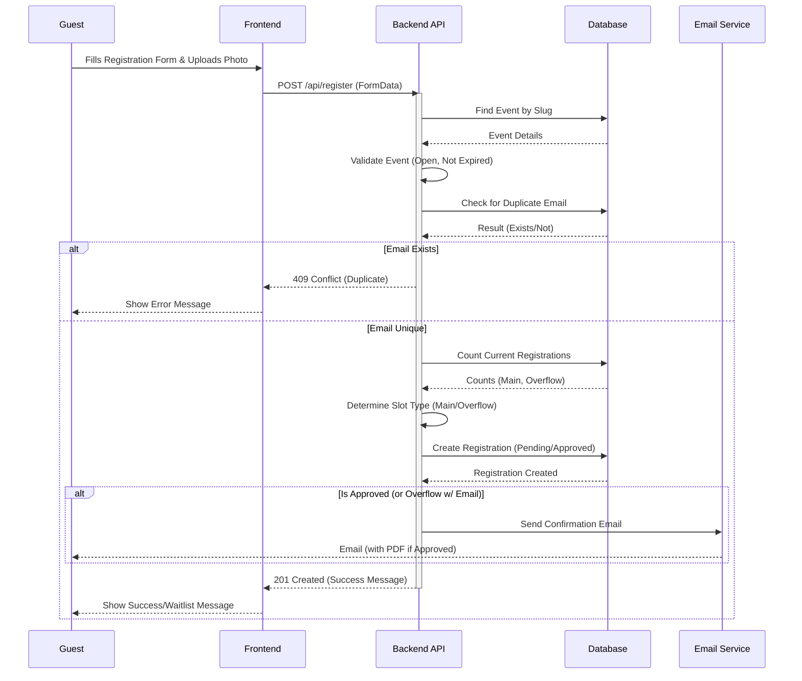

# Behavioral Diagrams

## Guest Registration Sequence Diagram

```mermaid
sequenceDiagram
    participant G as Guest
    participant FE as Frontend
    participant BE as Backend API
    participant DB as Database
    participant ES as Email Service

    G->>FE: Fills Registration Form & Uploads Photo
    FE->>BE: POST /api/register (FormData)

    activate BE
    BE->>DB: Find Event by Slug
    DB-->>BE: Event Details

    BE->>BE: Validate Event (Open, Not Expired)

    BE->>DB: Check for Duplicate Email
    DB-->>BE: Result (Exists/Not)

    alt Email Exists
        BE-->>FE: 409 Conflict (Duplicate)
        FE-->>G: Show Error Message
    else Email Unique
        BE->>DB: Count Current Registrations
        DB-->>BE: Counts (Main, Overflow)

        BE->>BE: Determine Slot Type (Main/Overflow)

        BE->>DB: Create Registration (Pending/Approved)
        DB-->>BE: Registration Created

        alt Is Approved (or Overflow w/ Email)
            BE->>ES: Send Confirmation Email
            ES-->>G: Email (with PDF if Approved)
        end

        BE-->>FE: 201 Created (Success Message)
        deactivate BE

        FE-->>G: Show Success/Waitlist Message
    end
```
