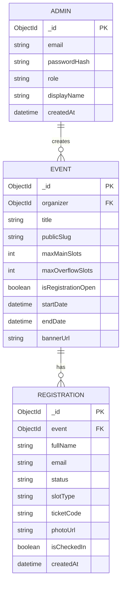

# Database Design

## Entity Relationship (ER) Diagram

```mermaid
erDiagram
    ADMIN {
        ObjectId _id PK
        string email
        string passwordHash
        string role
        string displayName
        datetime createdAt
    }

    EVENT {
        ObjectId _id PK
        ObjectId organizer FK
        string title
        string publicSlug
        int maxMainSlots
        int maxOverflowSlots
        boolean isRegistrationOpen
        datetime startDate
        datetime endDate
        string bannerUrl
    }

    REGISTRATION {
        ObjectId _id PK
        ObjectId event FK
        string fullName
        string email
        string status
        string slotType
        string ticketCode
        string photoUrl
        boolean isCheckedIn
        datetime createdAt
    }

    ADMIN ||--o{ EVENT : "creates"
    EVENT ||--o{ REGISTRATION : "has"
```
