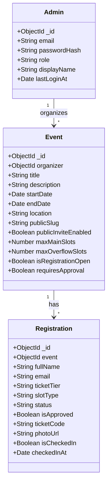

# Structural Diagrams

## Class Diagram

```mermaid
classDiagram
    class Admin {
        +ObjectId _id
        +String email
        +String passwordHash
        +String role
        +String displayName
        +Date lastLoginAt
    }

    class Event {
        +ObjectId _id
        +ObjectId organizer
        +String title
        +String description
        +Date startDate
        +Date endDate
        +String location
        +String publicSlug
        +Boolean publicInviteEnabled
        +Number maxMainSlots
        +Number maxOverflowSlots
        +Boolean isRegistrationOpen
        +Boolean requiresApproval
    }

    class Registration {
        +ObjectId _id
        +ObjectId event
        +String fullName
        +String email
        +String ticketTier
        +String slotType
        +String status
        +Boolean isApproved
        +String ticketCode
        +String photoUrl
        +Boolean isCheckedIn
        +Date checkedInAt
    }

    Admin "1" --> "*" Event : organizes
    Event "1" --> "*" Registration : has
```
