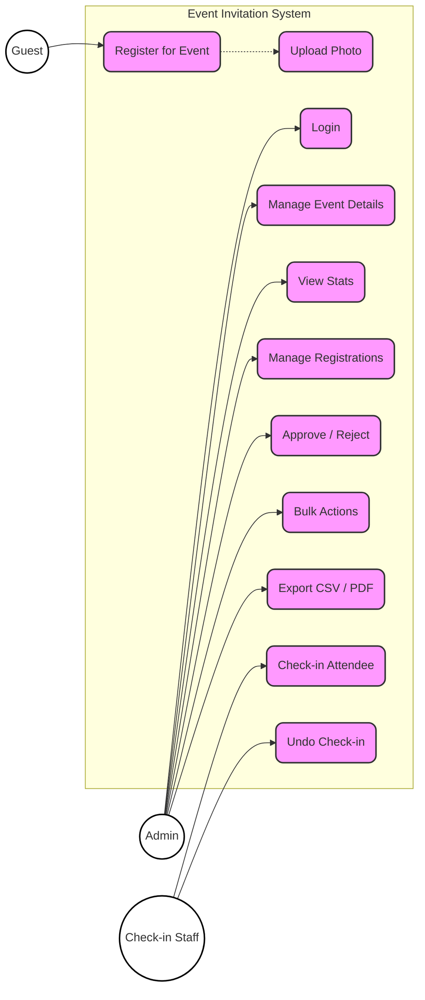

```mermaid
flowchart LR
    %% Actors
    Admin((Admin))
    Staff((Check-in Staff))
    Guest((Guest))

    %% System Boundary
    subgraph System [Event Invitation System]
        direction TB

        %% Admin Use Cases
        Login(Login)
        ManageEvent(Manage Event Details)
        ViewStats(View Stats)
        ManageReg(Manage Registrations)
        ApproveReg(Approve / Reject)
        BulkActions(Bulk Actions)
        Export(Export CSV / PDF)

        %% Check-in Staff Use Cases
        CheckIn(Check-in Attendee)
        UndoCheckIn(Undo Check-in)

        %% Guest Use Cases
        Register(Register for Event)
        UploadPhoto(Upload Photo)
    end

    %% Relationships
    Admin --> Login
    Admin --> ManageEvent
    Admin --> ViewStats
    Admin --> ManageReg
    Admin --> ApproveReg
    Admin --> BulkActions
    Admin --> Export

    Staff --> CheckIn
    Staff --> UndoCheckIn

    Guest --> Register
    Register -.-> UploadPhoto

    %% Layout adjustments to force Guest to the right
    Register ~~~ Guest

    %% Styling
    classDef actor fill:#fff,stroke:#000,stroke-width:2px;
    class Admin,Staff,Guest actor;

    classDef usecase fill:#f9f,stroke:#333,stroke-width:2px,rx:10,ry:10;
    class Login,ManageEvent,ViewStats,ManageReg,ApproveReg,BulkActions,Export,CheckIn,UndoCheckIn,Register,UploadPhoto usecase;
```
